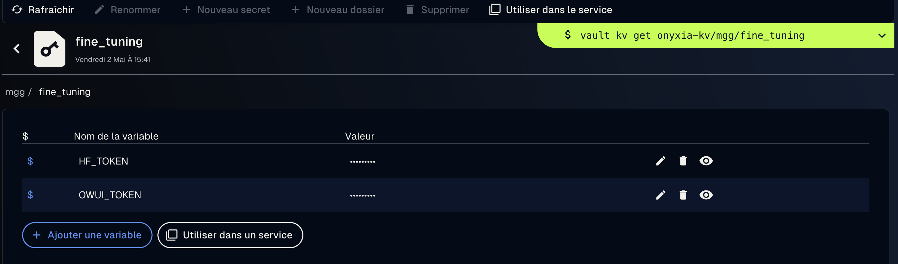

# Fine Tuning LLM

This projects aims at fine-tuning a LLM in order to make it understand and memorize a list of given acronyms.

The raw definition of acronyms is first boosted with an intruct LLM _via_ a remote LLM (through Open Web UI).

Then the model is trained using hugging face [transformers](https://huggingface.co/docs/transformers/v4.17.0/en/index) library.

Finally, we give insights on how the model can be tested and broadcasted.

## Project structure

The project consists in 3/4 parts :

- [00-set_up](00-set_up) : used to set up the training environment (either locally, datalab / google collab or onyxia)

- [01-create_dataset](01-create_dataset) : here we boost the raw definition of acronyms into fake conversations using a LLM through OpenWeb UI (hosted either locally, in Onyxia or RagaRenn for example.)

- [02-fine_tune](02-fine_tune) : here we load the model and trains it on the above conversations

- [03-test] : TOBEDONE.

## Getting started

Depending on where you run the notebooks, the set up is slightly different.

### Link to Hugging Face

To run the training - on whatever infrastructure, you'll need a HuggingFace account in order to retrieve base models from the hub. You also need to ask for an access to restricted models if you use one (p.e. Llama family).

You'll need to create an access token, and declare it.


### Run on Onyxia

Nearly nothing to do, everything is pre-cooked for you !

Just go in Onyxia instance SSPCloud Datalab : [https://datalab.sspcloud.fr](https://datalab.sspcloud.fr).

Connect and create a vault named `fine_tuning` with following secrets :

.

Then, simply click the following pre-cooked Onyxia Service :

> https://datalab.sspcloud.fr/launcher/ide/jupyter-pytorch-gpu?name=jupyter-pytorch-gpu&version=2.3.4&s3=region-ec97c721&init.personalInit=«https%3A%2F%2Fraw.githubusercontent.com%2Fmariusgarenaux%2Ffine_tuning_acronym%2Frefs%2Fheads%2Fmain%2F00-set_up%2Finit_onyxia.sh»&extraEnvVars[0].name=«WHICH_INFRA»&extraEnvVars[0].value=«%22onyxia%22»&vault.secret=«fine_tuning»&autoLaunch=true

### Run Locally

Git clone the project 
Set up a python .venv, activate and install libraries :

> Supported with Python 3.12.9 - not tested with earlier versions (might cause problems with recent ML libs - transformers, ...)

```bash
python -m venv .venv
source .venv/bin/activate
pip install -r 00-set_up/requirements.txt
```

Log in to hugging face by running in bash :

```bash
python -c "from huggingface_hub import login; login()"
```
> Say no if it asks to connect to git

Finally, create a config file with appropriated tokens at [conf/conf.yaml](conf/conf.yaml).

```yaml
OWUI_TOKEN: <your_owui_token>
OWUI_URL: https://<the_open_web_ui_instance_you_want_to_connect>/api/chat/completions
```

### Run on Datalab (GCP)

- open a terminal in JupyterLab

(- run 'bash' to have a non-archaic terminal)

- run the following (Git clone the project from github to the JupyterLab) :

```bash
git clone https://github.com/mariusgarenaux/fine_tuning_acronym
```

- install python libraries :

```bash
/opt/conda/bin/pip install -r 00-set_up/requirements.txt
```

- Log in to hugging face :

```bash
/opt/conda/bin/python3 -c "from huggingface_hub import login; login()"
```

- Create a config file; as in [Run Locally](#run-locally).

## Start fine-tuning !

The notebooks are in order. You need first to [create a dataset](01-create_dataset/create_dataset.ipynb). Then you can [fine-tune a model](02-fine_tune/training.ipynb). Finally, [test it](03-test).

## Source

Training notebook and scripts were adapted from https://colab.research.google.com/drive/1DqKNPOzyMUXmJiJFvJITOahVDxCrA-wA#scrollTo=9Ixtdtpgyv_a; and hugging face documentation (p.e. https://huggingface.co/learn/llm-course/en/chapter11/3).