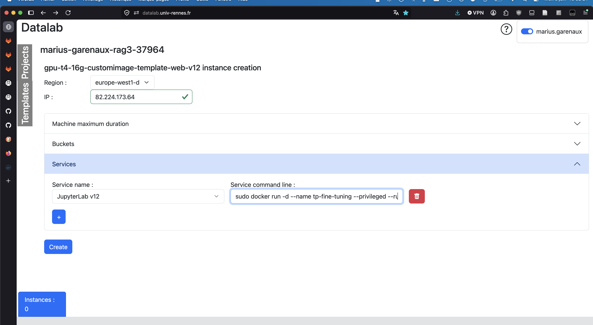

## build

To build the image, in linux :

```bash
git clone https://github.com/mariusgarenaux/fine_tuning_acronym
cd fine_tuning_acronym
git checkout formation-continue
docker build -t tp_fine_tuning .
```

To upload to the hub :

```bash
docker login -u mgg3
docker tag tp_fine_tuning mgg3/tp_fine_tuning:0.14
docker push mgg3/tp_fine_tuning:0.14
```

## run it locally

> ! the container is quite permisive, and should be run only in isolated environment (see below datalab.univ-rennes.fr) !
> If you built it locally :

```bash
docker run -d --name tp_fine_tuning --runtime=nvidia --gpus all -p 8888:8888 tp_fine_tuning
```

> this should expose a jupyter lab locally, at : 127.0.0.1:8888/notebook/?token=token

> for CPU only, you can get rid of --runtime and --gpus params

To use image from docker hub directly :

```bash
docker run -d --name tp_fine_tuning --runtime=nvidia --gpus all -p 8888:8888 mgg3/tp_fine_tuning:0.13
```

> this should expose a jupyter lab locally, at : 127.0.0.1:8888/notebook/?token=token

## run it in datalab.univ-rennes.fr

In services, remove the text, and replace it by :

```bash
sudo docker run -d --name tp_fine_tuning --privileged --runtime=nvidia --gpus all -v /myhomedir/bucket:/root/bucket -w /root -e HOME=/root --network host -e PASSWORD=$USER_PASSWORD mgg3/tp_fine_tuning:0.13
```



> this will fetch from docker hub the image
> ! an other jupyter lab might be running on the GCP VM. You have to kill it to get back the access to port 8888 (`sudo ss -ltnp | grep :8888` and `kill <pid>`). After killing it, restarting the container will make it take the port 8888.
> A one liner is to replace the text in service by this :

```bash
sudo systemctl disable --now jupyter.service && sudo systemctl mask jupyter.service && sudo docker run -d --name tp_fine_tuning --privileged --runtime=nvidia --gpus all -v /myhomedir/bucket:/root/bucket -w /root -e HOME=/root --network host -e PASSWORD=$USER_PASSWORD mgg3/tp_fine_tuning:0.13
```

> It stops and disable the GCP jupyter lab service from running, and blocking port 8888
